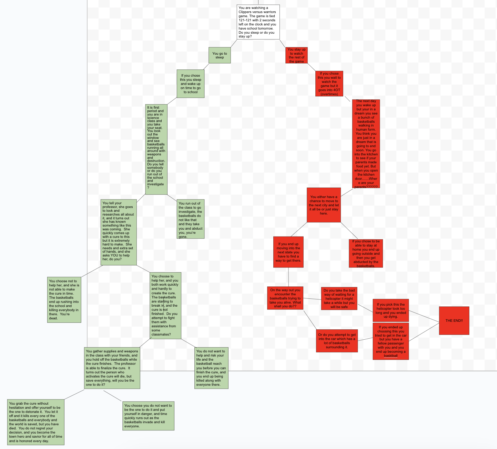

<!DOCTYPE html>
<html lang="en">

<head>
    <title class="owner-name">#</title>
    <meta charset="utf-8">
    <meta name="viewport" content="width=device-width, initial-scale=1">
    <link rel="stylesheet" href="https://stackpath.bootstrapcdn.com/bootstrap/4.3.1/css/bootstrap.min.css">
    <link href="https://fonts.googleapis.com/css?family=Montserrat" rel="stylesheet">
    <link href="https://cdn.jsdelivr.net/npm/prismjs@1.29.0/themes/prism.css" rel="stylesheet" />
    <link rel="stylesheet" href="../style.css" type="text/css">
    
    
    

</head>

<body>

<!-- Navbar -->

<nav class="navbar navbar-expand-lg navbar-dark bg-dark">
        
        <button class="navbar-toggler" type="button" data-toggle="collapse" data-target="#navbarSupportedContent" aria-controls="navbarSupportedContent" aria-expanded="false" aria-label="Toggle navigation">
            
        </button>

            <ul class="navbar-nav mr-auto">
                <li class="nav-item">
                    <a class="nav-link" href="../index.html">Home</a>
                </li>
                <li class="nav-item">
                    <a class="nav-link" href="#" id="github" target="_blank">Github</a>
                </li>
                <li class="nav-item">
                    <a class="nav-link" href="../index.html#projects">Projects</a>
                </li>
            </ul>
     

</nav>

 <!-- First Container -->
 

        

<h1 class="margin text-center">Basketball Apocalypse</h1>

in this project i created my own adventure in a storyline, that could be different in whichever path the user wanted to take their "life".  We created a story about a basketball apocalypse, basketballs coming to life and terrorizing a town.  Based on the users choices in which they wanted to take the life, there was a positive and a negative outcome.  Every decision matters, and every little thing can pursuade which way life goes.

This project was essentially to work on github and ide skills, but more importantly about collaborating.  Working with another pier on a major project, in different settings, at different times, but also communicating so that you both can get it done and creat the best project that you could.  The hardest part of this project was definitely the communicating aspect of it, being in completely different areas not knowing what the other person is thinking and not talking face to face.  You have to put a lot of trust into what your partner is putting into the project and how that they are going about it.  You also have to talk it out and prepare everything that you need to get done and how you both are going to cooperate on all of it.  Me and my partner both talked it out very well, and collaborated well to complete this project.  There were some flaws at times, but i think it is nothing that we can't clean up we just need to talk more and understand the topic a little better to make it go even smoother.

<a href="https://github.com/bishoyb1251/Basketball-apocalypse.md"><a> 

<a href="http://bishoyb1251.github.io/Basketball-apocalypse.md">Preview</a> 
<a href="https://github.com/bishoyb1251/Basketball-apocalypse.md.git">Github</a> 

 <!--
                

                    Use this to...
                

                

                    ...make two columns
                

     -->

 

 

<!-- Footer -->
<footer class="container-fluid bg-4 text-center">
 

</footer>

    
    
    
</body>

</html>
